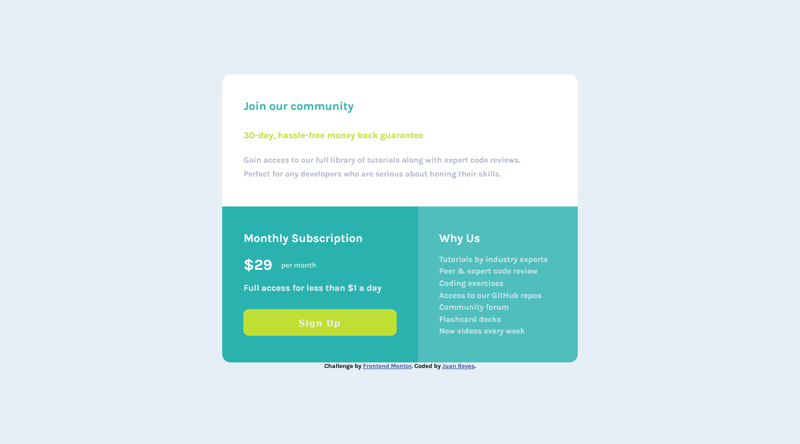

# Frontend Mentor - Single price grid component


## Deploying your project

As mentioned above, there are many ways to host your project for free. Our recommended hosts are:

- [GitHub Pages](https://pages.github.com/)
- [Vercel](https://vercel.com/)
- [Netlify](https://www.netlify.com/)

## Got feedback for us?

We love receiving feedback! We're always looking to improve our challenges and our platform. So if you have anything you'd like to mention, please email hi[at]frontendmentor[dot]io.

This challenge is completely free. Please share it with anyone who will find it useful for practice.

# Frontend Mentor - Single price grid component solution

This is a solution to the [Single price grid component challenge on Frontend Mentor](https://www.frontendmentor.io/challenges/single-price-grid-component-5ce41129d0ff452fec5abbbc). Frontend Mentor challenges help you improve your coding skills by building realistic projects. 

## Table of contents

- [Overview](#overview)
  - [The challenge](#the-challenge)
  - [Screenshot](#screenshot)
  - [Links](#links)
- [My process](#my-process)
  - [Built with](#built-with)
  - [What I learned](#what-i-learned)
  - [Continued development](#continued-development)
- [Author](#author)


## Overview
- Es un reto interesante, en el que una tarjeta de promoción con un precio único se dispone
de forma, que queda un contenedor encima de otro. Pero luego en escritorio se disponen en 
una cuadrícula de dos columnas, donde la que estaba arriba abarca 2 cuadrículas y las dos
restantes se disponen una al lado de la otra.

### The challenge

- En este caso para la transición de móvil a escritorio apenas hay cambios. Tan solo disponer mis cuadrículas de la forma que especifica el reto.

- En el botón que llama a la acción he puesto un `:hover` que le cambia los estilos y el color de la sombra que tenía.

### Screenshot



### Links

- Solution URL: [solución reto](https://github.com/juan-mentor/single-price-grid-component-master)
- Live Site URL: [sitio en vivo](https://juan-mentor.github.io/single-price-grid-component-master/)

## My process
- En este caso, después de descargado los archivos y medido los contenedores, así como el tamaño, color, tipo de tipografía, márgenes, etc. Me he centrado en el diseño móvil de 375px.

- Después he llamado a una consulta de medios a 640px para centrar me en el diseño escritorio (1440px).

- Por último he puesto una pequeña transición, cuando se le pasa el ratón, al botón de llamada a la acción.

### Built with

- Semantic HTML5 markup
- CSS custom properties
- CSS Grid
- Mobile-first workflow

### What I learned

- He aprendido que las unidades fr, admiten decimales. En este caso no se de que otra forma lo haría, quizás aplicando flexbox.

```css
.single-price {
  grid-template-columns: 1.1fr 0.9fr;
}
```

### Continued development

- Seguir aprendiendo sobre flexbox y Css Grid

## Author

- Frontend Mentor - [@juan-mentor](https://www.frontendmentor.io/profile/juan-mentor)